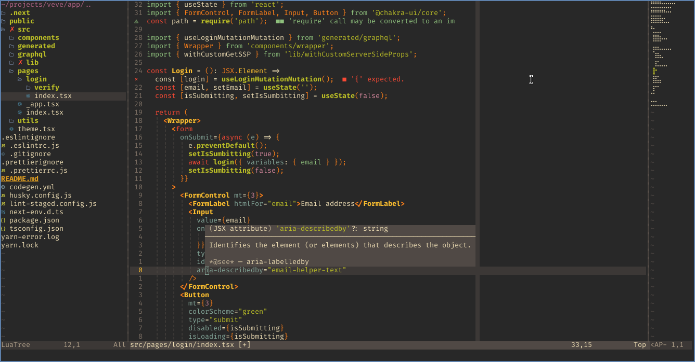

## ma.nvim



### Requirements

- Latest [neovim](https://github.com/neovim/neovim) build
- Arch Linux (paru installed)/MacOs (brew installed)
- [ripgrep](https://github.com/BurntSushi/ripgrep#installation)

### Install config

```sh
mv ~/.config/nvim{,.bak}
mv ~/.local/share/nvim{,.bak}
mv ~/.local/state/nvim{,.bak}
mv ~/.cache/nvim{,.bak}

git clone https://github.com/22mahmoud/nvim ~/.config/nvim
~/.config/nvim/scripts/setup
nvim --noplugin +PkgInstall +qa
```

### Features

- ️⛏️ Minimal Setup
- 📦 Use neovim built-in vim [packages](https://neovim.io/doc/user/repeat.html#packages) to manage external plugins using this
  wrapper [pkg-manager.lua](https://github.com/22mahmoud/nvim/blob/master/lua/ma/pkg-manager.lua), so you can add new plugin with
  ```lua
  use 'neovim/lspconfig'
  ```
  check for the installed plugins in [plugins.lua](https://github.com/22mahmoud/nvim/blob/master/lua/ma/plugins.lua) and [after/plugin](https://github.com/22mahmoud/nvim/tree/master/after/plugin) directory for their configuration
- 🎨 Nice Looking [statusline](https://github.com/22mahmoud/nvim/blob/master/lua/ma/statusline.lua) & winbar
- ️🎹 Use neovim built-in vim [ins-completions](https://neovim.io/doc/user/insert.html#ins-completion), ~~and a custom
  [script](https://github.com/22mahmoud/nvim/blob/8a4e98dd572db66ba7b035a769ce8a423c8f67b6/lua/ma/cmp.lua) to add auto-import functionality when insert from LSP omni completion~~
  and the built-in neovim [lsp compleitions](https://github.com/22mahmoud/nvim/blob/8a4e98dd572db66ba7b035a769ce8a423c8f67b6/lua/ma/cmp.lua).
- 💊 a custom GraphQL client to execute `gql` queries/mutations with the keymap
  <kbd>,</kbd> + <kbd>e</kbd>
  [](https://asciinema.org/a/696741)
